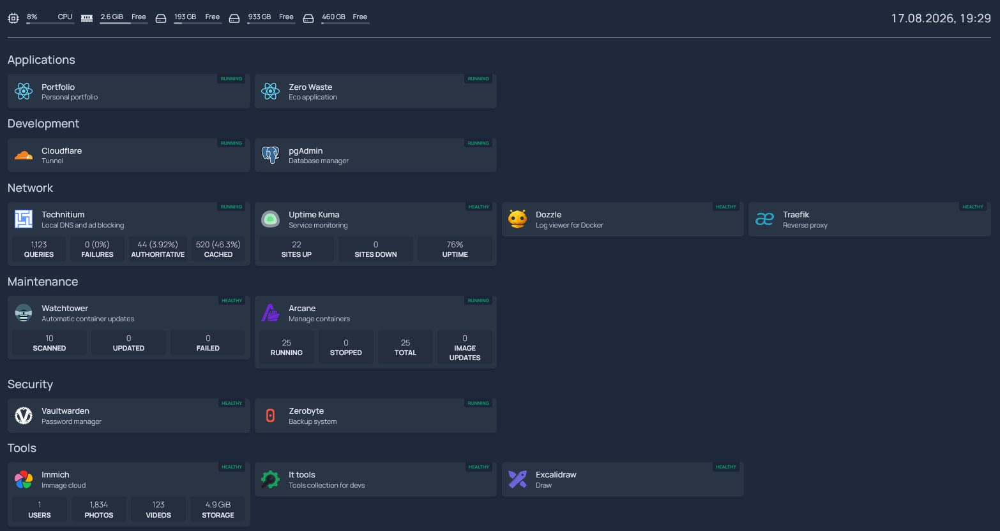

# 🏠 Homelab
My personal self-hosted homelab running on repurposed hardware.
The goal of this project is to run useful self-hosted services while learning more about Docker, networking, reverse proxies, DNS, monitoring, backups, and infrastructure management.

> This repository contains the infrastructure configuration for my homelab.
> Personal projects and sensitive configuration are kept separately and are not included.
---
## 🖥️ Hardware
The homelab runs on an old PC that I repurposed as a server.
| Component | Specification |
|---|---|
| CPU | Intel Core i5-6500 |
| RAM | 8 GB |
| System storage | 250 GB SSD |
| Additional storage | 1 TB HDD |
| Backup storage | 500 GB external drive |

The goal is to make the most out of relatively old hardware rather than relying on expensive server equipment.

---
## 🐳 Stack

The homelab is built around Docker Compose.

A root `docker-compose.yml` is used to include the individual service Compose files:


```text

docker-compose.yml
├── homepage/docker-compose.yml
├── traefik/docker-compose.yml
├── socket-proxy/docker-compose.yml
├── watchtower/docker-compose.yml
├── immich/docker-compose.yml
├── pgadmin/docker-compose.yml
├── uptime-kuma/docker-compose.yml
├── zerobyte/docker-compose.yml
├── vaultwarden/docker-compose.yml
├── technitium/docker-compose.yml
├── it-tools/docker-compose.yml
├── excalidraw/docker-compose.yml
├── dozzle/docker-compose.yml
├── arcane/docker-compose.yml
└── cloudflared/docker-compose.yml
```

This keeps each service isolated in its own directory while still allowing the entire homelab to be managed from the root.
* * *
🧩 Services
-----------
| Service | Purpose |
|---|---|
| [Traefik](https://traefik.io/) | Reverse proxy and TLS termination |
| [Cloudflare Tunnel](https://developers.cloudflare.com/cloudflare-one/connections/connect-networks/) | Secure external access through Cloudflare |
| [Homepage](https://gethomepage.dev/) | Homelab dashboard |
| [Immich](https://immich.app/) | Self-hosted photo and video management |
|  [Vaultwarden](https://github.com/dani-garcia/vaultwarden) |Self-hosted password manager |
| [Technitium DNS](https://technitium.com/dns/) | Local DNS server and ad blocking |
| [Uptime Kuma](https://github.com/louislam/uptime-kuma) |  Service monitoring |
| [Dozzle](https://dozzle.dev/) | Docker container log viewer |
| [Arcane](https://getarcane.app/) | Docker container management |
| [Watchtower](https://containrrr.dev/watchtower/) | Automated container updates |
| [ZeroByte](https://github.com/nicotsx/zerobyte) | Backup management |
| [pgAdmin](https://www.pgadmin.org/) | PostgreSQL administration |
| [IT-Tools](https://it-tools.tech/) | Collection of developer utilities |
| [Excalidraw](https://excalidraw.com/) | Diagramming and drawing |

* * *

🌐 Network Architecture
-----------------------

The homelab uses several dedicated Docker bridge networks.

                         Internet
                            │
                            ▼
                     ┌─────────────┐
                     │  Cloudflare │
                     └──────┬──────┘
                            │
                   Cloudflare Tunnel
                            │
                            ▼
                       ┌─────────┐
                       │ Traefik │
                       └────┬────┘
                            │
                         proxy
                            │
        ┌───────────────────┼────────────────────┐
        │                   │                    │
        ▼                   ▼                    ▼
     Immich             Vaultwarden          Homepage
        │                   │                    │
        └───────────────────┴────────────────────┘

                 Docker API access
                        │
                        ▼
                ┌────────────────┐
                │ Socket Proxy   │
                └───────┬────────┘
                        │
                        ▼
                  Docker Engine

### Docker networks

| Network | Purpose |
|--|--|
| `proxy` | Main network for services exposed through Traefik |
| `socket-proxy` | Read-only Docker API access for services such as Traefik, Homepage, Updatime Kuma and Dozzle. |
| `homepage` | Network used by Homepage and services providing dashboard integrations |
| `watchtower` | Network used by Watchtower-related services |
| `watchtower-internal` | Private network connecting Watchtower to its dedicated Docker socket proxy. |
| `arcane-internal` | Private network connecting Arcane to its dedicated Docker socket proxy |

The networks are defined centrally in the root Compose file.

``` YAML
networks:
  proxy:
    name: proxy
    driver: bridge
  socket-proxy:
    name: socket-proxy
    driver: bridge
  homepage:
    name: homepage
    driver: bridge
  watchtower:
    name: watchtower
    driver: bridge
  arcane-internal:
    name: arcane-internal
    driver: bridge
    internal: true
  watchtower-internal:
    name: watchtower-internal
    driver: bridge
    internal: true
```
* * *

🔐 Docker Socket Proxy
----------------------

Services that need access to the Docker API do not directly expose the Docker socket to the container where possible.

Instead, dedicated socket proxies are used.

                      ┌──────────────────────┐
                      │       Docker         │
                      │    Docker Socket     │
                      └──────────┬───────────┘
                                 │
            ┌────────────────────┼────────────────────┐
            │                    │                    │
            ▼                    ▼                    ▼
    ┌─────────────────┐  ┌─────────────────┐   ┌─────────────────┐
    │  Read-only      │  │   Watchtower    │   │     Arcane      │
    │  Socket Proxy   │  │  Socket Proxy   │   │  Socket Proxy   │
    │                 │  │                 │   │                 │
    │ Traefik         │  │ Watchtower      │   │ Arcane          │
    │ Homepage        │  │                 │   │                 │
    │ Dozzle          │  │ Container       │   │ Container       │
    │ Uptime Kuma     │  │ updates         │   │ management      │
    └─────────────────┘  └─────────────────┘   └─────────────────┘


### Read-only Docker Proxy

*   Traefik
*   Homepage
*   Dozzle
*   Uptime Kuma

The proxy is configured for Docker API discovery without allowing container modifications.
```
CONTAINERS=1
EVENTS=1
NETWORKS=1
INFO=1
POST=0
```

### Watchtower Docker Proxy
Watchtower has its own Docker API proxy because it needs permission to update containers.

It is allowed to:
* Read containers and images
* Receive Docker events
* Stop containers
* Start containers
* Restart containers
* Recreate containers during updates


### Arcane Docker Proxy
Arcane has its own Docker API proxy because it is used as the Docker management interface.

It has additional permissions required for container management, including:

* Container operations
* Image management
* Network management
* Volume management
* Container execution

This keeps Arcane's elevated Docker permissions isolated from services that only need read-only access.

* * *

🚦 Traefik
----------

Traefik acts as the main reverse proxy for the homelab.

Services are automatically discovered through Docker labels.

For example:

```YAML

labels:
  - "traefik.enable=true"
  - "traefik.http.routers.example.rule=Host(`example.${DOMAIN}`)"
  - "traefik.http.routers.example.entryPoints=websecure"
  - "traefik.http.routers.example.tls=true"
  ```

Docker discovery is performed through the socket proxy:

```YAML
providers:
  docker:
    endpoint: "tcp://socket-proxy:2375"
    exposedByDefault: false
    network: proxy
```

Only containers explicitly enabled with:

`traefik.enable=true`

are exposed through Traefik.

* * *

🔒 HTTPS
--------

Traefik manages HTTPS certificates using Let's Encrypt with a Cloudflare DNS challenge.

    Let's Encrypt
      │
      ▼
    Traefik
      │
      ▼
    Cloudflare DNS

Certificates are stored locally and are intentionally excluded from this repository.

* * *

☁️ Cloudflare
-------------
External access is provided through Cloudflare Tunnel.

This allows services to be published without directly exposing every application to the public internet.

The Cloudflare Tunnel token is stored in the local `.env` file and is never committed to the repository.

* * *

📊 Monitoring
-------------

### Homepage

Homepage provides a central dashboard for the infrastructure.

Services are automatically discovered using Docker labels rather than being manually listed in the Homepage services configuration.

The dashboard is organized into groups such as:

*   Applications

*   Development

*   Network

*   Security

*   Tools

*   Maintenance


### Uptime Kuma

Uptime Kuma is used to monitor the availability of services.

### Dozzle

Dozzle provides a web interface for viewing Docker container logs.

* * *

💾 Storage & Backups
--------------------

The server uses several storage locations:
```text
250 GB SSD
└── Operating system and Docker workloads

1 TB HDD
└── Application data / storage

500 GB external drive
└── Backups
```

Backup management is handled with ZeroByte.

Storage paths are configured through environment variables and local configuration where possible.

* * *

⚙️ Configuration
----------------

Sensitive configuration is stored in a local `.env` file.

The repository contains an example .env in:

`.env.example`

while the real:

`.env`

remains only on the server.

Example:

```dotenv
DOMAIN=example.com
TZ=Europe/Warsaw

ACME_EMAIL=
CF_DNS_API_TOKEN=

CLOUDFLARE_TUNNEL_TOKEN=

WATCHTOWER_API_KEY=

TECHNITIUM_API_KEY=

TECHNITIUM_PASSWORD=

PG_EMAIL=

PG_PASSWORD=

VAULTWARDEN_PASSWORD=

ZERO_BYTE_SECRET=

UPTIME_KUMA_API_KEY=

IMMICH_VERSION=

UPLOAD_LOCATION=

DB_DATA_LOCATION=

DB_PASSWORD=

DB_USERNAME=

DB_DATABASE_NAME=

IMMICH_API_KEY=
```

> The example above contains placeholder values only. Never commit real credentials.

* * *

🔑 Secrets
----------

The following types of files and values must never be committed:

*   `.env`

*   API keys

*   Passwords

*   Cloudflare tokens

*   Cloudflare API credentials

*   Let's Encrypt certificates

*   Private keys

*   Database files

*   Application runtime data

*   Docker socket data

*   Authentication databases


Sensitive files are excluded through `.gitignore`.

* * *

📁 Repository Structure
-----------------------
```text
.
├── arcane/
│   └── docker-compose.yml
├── cloudflared/
│   └── docker-compose.yml
│
├── dozzle/
│   └── docker-compose.yml
│
├── excalidraw/
│   └── docker-compose.yml
│
├── homepage/
│   ├── config/
│   │   ├── bookmarks.yaml
│   │   ├── custom.css
│   │   ├── custom.js
│   │   ├── docker.yaml
│   │   ├── kubernetes.yaml
│   │   ├── proxmox.yaml
│   │   ├── services.yaml
│   │   ├── settings.yaml
│   │   └── widgets.yaml
│   └── docker-compose.yml
│
├── immich/
│   └── docker-compose.yml
│
├── it-tools/
│   └── docker-compose.yml
│
├── pgadmin/
│   └── docker-compose.yml
│
├── projects/
│   └── ...
│
├── socket-proxy/
│   └── docker-compose.yml
│
├── technitium/
│   ├── config/
│   └── docker-compose.yml
│
├── traefik/
│   ├── config.yaml
│   ├── docker-compose.yml
│   └── traefik.yaml
│
├── uptime-kuma/
│   └── docker-compose.yml
│
├── vaultwarden/
│   └── docker-compose.yml
│
├── watchtower/
│   └── docker-compose.yml
│
├── zerobyte/
│   └── docker-compose.yml
│
├── docker-compose.yml
├── .env.example
├── .gitignore
└── README.md

```
* * *

🚀 Deployment
-------------

Clone the repository:

```Bash
git clone https://github.com/Kamil-Mroz/homelab.git
cd homelab
```
Create the environment file:
```Bash
cp .env.example .env
```

Edit the configuration:

```Bash
nano .env
```
Start the homelab:

```Bash
docker compose up -d
```
Check the running services:

```Bash
docker compose ps
```
View logs:

```Bash
docker compose logs -f
```
View logs for a specific service:

```Bash
docker compose logs -f traefik
```
Stop the stack:
```Bash
docker compose down
```
Pull updated images:

```Bash
docker compose pull
```
Recreate the services:

```Bash
docker compose up -d
```
* * *

🔄 Updates
----------

Watchtower is used for automated container image updates.

Only containers explicitly configured for Watchtower updates are automatically updated.

For example:

```YAML
labels:
  - "com.centurylinklabs.watchtower.enable=true"
  ```

Infrastructure-critical services can be excluded:

```YAML
labels:
  - "com.centurylinklabs.watchtower.enable=false"
  ```

This allows updates to be controlled on a per-service basis.

* * *

🛠️ Management
------------------------

Arcane is used as the primary Docker management interface.

It provides a web interface for:

* Viewing containers
* Starting and stopping containers
* Managing images
* Managing Docker Compose projects
* Viewing container logs
* Managing Docker resources

Arcane communicates with Docker through its own dedicated socket proxy.

* * *

🏗️ Compose Architecture
------------------------

The root Compose file is intentionally kept small.

It primarily handles:

1.  Including individual service Compose files.
2.  Defining shared Docker networks.


Example:

```YAML

include:
  - ./arcane/docker-compose.yml
  - ./homepage/docker-compose.yml
  - ./traefik/docker-compose.yml
  - ./socket-proxy/docker-compose.yml
  - ./watchtower/docker-compose.yml
  - ./immich/docker-compose.yml
  - ./pgadmin/docker-compose.yml
  - ./uptime-kuma/docker-compose.yml
  - ./zerobyte/docker-compose.yml
  - ./vaultwarden/docker-compose.yml
  - ./technitium/docker-compose.yml
  - ./it-tools/docker-compose.yml
  - ./excalidraw/docker-compose.yml
  - ./dozzle/docker-compose.yml
  - ./cloudflared/docker-compose.yml
  ```

This makes it possible to manage the whole environment using:

```Bash
docker compose up -d
```

while keeping each service independently organized.

* * *

🌐 Service Routing
------------------

Most web applications are exposed through Traefik using subdomains.

The general pattern is:

`https://<service>.${DOMAIN}`

Examples include:

```text
https://home.${DOMAIN}
https://immich.${DOMAIN}
https://vault.${DOMAIN}
https://dns.${DOMAIN}
https://uptime.${DOMAIN}
https://arcane.${DOMAIN}
https://dozzle.${DOMAIN}
```

The actual domain is configured through the `.env` file.

* * *

🛡️ Security
------------

The homelab follows a few basic security principles:

* Docker socket is not directly exposed to applications.
* Separate socket proxies are used for different privilege levels.
* Read-only Docker API access is used wherever possible.
* Docker containers use no-new-privileges where supported.
* External services are exposed through Traefik.
* HTTPS certificates are automatically managed through Cloudflare DNS challenge.
* Automatic updates are opt-in through Watchtower labels.
* Secrets and .env files are excluded from Git.
* Persistent application data and databases are excluded from the configuration repository.
* Internal Docker networks are used for infrastructure components that should not be externally reachable.

* * *

📦 Data That Is Not Stored in Git
---------------------------------

This repository intentionally does not contain application runtime data.

Examples include:
```text
.env
*.env
acme.json
cf-token
password.txt


Vaultwarden database
Uptime Kuma database
Immich PostgreSQL database
Technitium runtime data
Application caches
Application logs
Temporary files
Private keys
```

The repository contains the configuration required to understand and recreate the infrastructure, rather than a backup of the running containers.

* * *

🎯 Goals
--------

The main goals of this homelab are:

*   🏠 Self-host useful services
*   ☁️ Build a personal cloud
*   🌐 Run my own DNS infrastructure
*   🔐 Learn about secure networking and reverse proxies
*   💾 Automate backups
*   🐳 Improve my Docker and Docker Compose skills
*   🚀 Host my own projects
*   📊 Monitor the infrastructure
*   🛠️ Learn by running real infrastructure on inexpensive hardware


* * *

🛣️ Roadmap
-----------

Things I would like to improve over time:

- [ ] Improve backup strategy
- [ ] Add more infrastructure monitoring
- [ ] Improve Docker security
- [ ] Add resource limits where appropriate
- [ ] Add more self-hosted services
- [ ] Improve observability
- [ ] Experiment with Kubernetes


* * *

📚 What I'm Learning
--------------------

This homelab is also a learning environment.

Through it I'm gaining practical experience with:

*   Docker
*   Docker Compose
*   Linux administration
*   Reverse proxies
*   TLS / HTTPS
*   Cloudflare
*   DNS
*   Networking
*   Container security
*   Monitoring
*   Backups
*   Self-hosting
*   Infrastructure as Code
*   Service discovery
*   Container networking

* * *

📸 Dashboard
------------



* * *

⚠️ Disclaimer
-------------

This repository is primarily a documentation and configuration project.

Some configuration files and application data have intentionally been omitted because they contain sensitive information or runtime data.

Do not blindly copy this configuration into a production environment.

Review the security configuration, credentials, storage paths, exposed services, and network configuration before deploying.

* * *

📄 License
----------

This repository contains my personal homelab configuration.

Feel free to use it as inspiration for your own homelab, but review and adapt the configuration to your own environment before deploying it.
